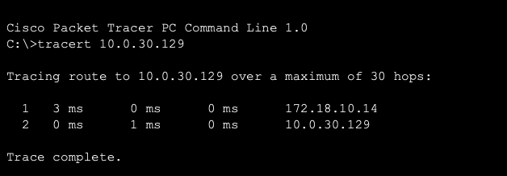
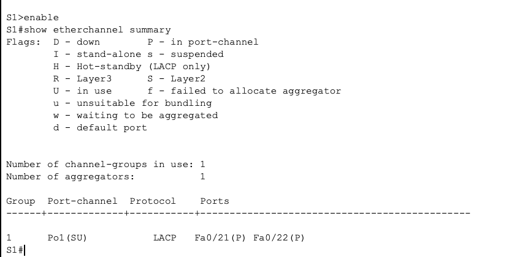

cat << 'EOF' > README.md
# Architecture Reseau d'Entreprise : Switching, Routing & WAN

## Description du Projet
Ce projet, realise dans le cadre du module **Reseaux Informatiques**, consiste en la conception et le deploiement d'une infrastructure reseau complete simulant un siege social connecte a des sites distants.

L'objectif est de demontrer la maitrise des protocoles de **Commutation (Switching)**, de **Routage Inter-VLAN** et d'**Interconnexion WAN**.

* **Etudiant :** [Boustane Oussama](https://www.linkedin.com/in/oussama-boustane-22a990298/)
* **Annee :** 2025/2026

---

## Topologie et Architecture

Le reseau est constitue de :
* **3 Routeurs Cisco 2811** (Zone WAN et Coeur de reseau).
* **2 Switchs Cisco 2960-24TT** (Zone LAN Access/Distribution).
* **Postes Clients** repartis sur differents VLANs.

### Inventaire du Materiel
| Equipement | Modele | Role Principal |
| :--- | :--- | :--- |
| **R1** | Cisco 2811 | Passerelle LAN & Sortie WAN |
| **R2** | Cisco 2811 | Routeur de Transit (FAI) |
| **R3** | Cisco 2811 | Site Distant (Internet) |
| **S1** | Cisco 2960 | Distribution & Agregation |
| **S2** | Cisco 2960 | Acces Clients |

### Plan d'Adressage IP
| Peripherique | Interface | IP / Masque | Description |
| :--- | :--- | :--- | :--- |
| **R1** | Fa0/0.10 | 172.18.10.14 /28 | GW VLAN 10 |
| | S0/0/0 | 10.0.30.177 /30 | Vers R2 |
| **R3** | Loopback0| 10.0.30.129 /32 | Serveur Test |
| **S2** | Vlan60 | 172.18.60.2 /28 | Management |

---

## Fonctionnalites Configurees

### 1. Commutation (Switching)
* **VLANs :** Segmentation du reseau en 5 VLANs (10, 20, 30, 50, 60).
* **EtherChannel (LACP) :** Agregation de liens entre S1 et S2.
* **Trunking (802.1Q) :** Transport des VLANs.

### 2. Routage (Routing)
* **Router-on-a-Stick :** Configuration de sous-interfaces sur R1.
* **Routage WAN :** Liaisons series avec encapsulation HDLC.
* **Routage Statique & Resume :** Optimisation des tables de routage.

---

## Preuves de Fonctionnement

### Test de Connectivite WAN (Ping/Traceroute)
Le traceroute ci-dessous demontre que les paquets traversent correctement le reseau local, le routeur central (R1) pour atteindre la cible distante sur Internet (simulee).

### Verification EtherChannel (LACP)
Configuration validee sur le Switch S1 (Flags SU et P).

---

## Structure du Depot

* `/configs` : Fichiers de configuration (Show running-config).
* `/images` : Captures d'ecran du projet.
* `Architecture_Reseau.pkt` : Le fichier de simulation Packet Tracer.

---
*Projet academique.*
