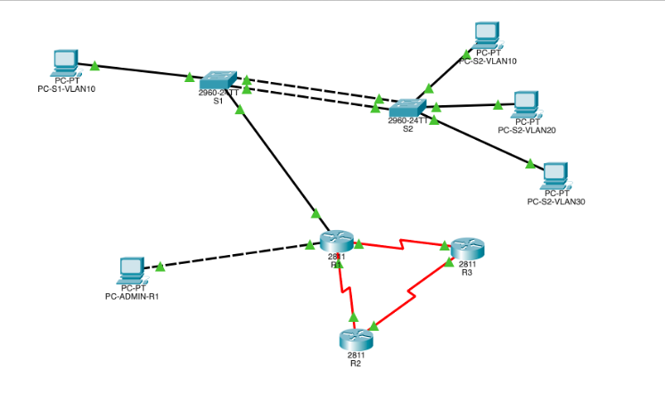

# 1. On vide le fichier et on écrit la première partie
cat << 'EOF' > README.md
# Architecture Reseau d'Entreprise : Commutation, Routage et WAN


## 1. Vue d'Ensemble du Projet

Ce depot contient la documentation technique et les fichiers de configuration relatifs a la conception d'une infrastructure reseau hierarchique. L'architecture simule l'interconnexion d'un siege social avec des sites distants a travers une liaison WAN, en respectant les standards de l'industrie.

* **Auteur :** [Boustane Oussama](https://www.linkedin.com/in/oussama-boustane-22a990298/)
* **Contexte :** Module Reseaux Informatiques
* **Annee Academique :** 2025/2026

---

## 2. Perimetre Technique

Ce projet valide l'acquisition des competences suivantes :
1. **Commutation Avancee :** Implementation de VLANs, trunking (802.1Q) et agregation de liens (LACP).
2. **Routage Inter-VLAN :** Configuration "Router-on-a-Stick" assurant la communication entre les segments reseau.
3. **Infrastructure WAN :** Deploiment de liaisons series et routage dynamique.
4. **Optimisation :** Mise en oeuvre du resume de routes (Route Summarization).

---

## 3. Topologie et Materiel

Le coeur du reseau repose sur un routeur central (R1) gérant les passerelles logiques, connecte a une couche de distribution/acces.



### Inventaire des Equipements

| Equipement | Modele | Role Principal |
| :--- | :--- | :--- |
| **Routeur R1** | Cisco 2811 | Passerelle LAN & Sortie WAN |
| **Routeur R2** | Cisco 2811 | Routeur de transit (FAI/WAN) |
| **Routeur R3** | Cisco 2811 | Destination distante (Simulation Internet) |
| **Switch S1** | Cisco 2960 | Distribution & Agregation |
| **Switch S2** | Cisco 2960 | Acces Clients & Management |

---

## 4. Plan d'Adressage (VLSM)

| Peripherique | Interface | Adresse IP | Masque (CIDR) | Description |
| :--- | :--- | :--- | :--- | :--- |
| **R1** | Fa0/0.10 | 172.18.10.14 | /28 | Passerelle VLAN 10 |
| | Fa0/0.20 | 172.18.20.14 | /28 | Passerelle VLAN 20 |
| | Fa0/0.30 | 172.18.30.14 | /28 | Passerelle VLAN 30 |
| | S0/0/0 | 10.0.30.177 | /30 | Liaison vers R2 |
| **R2** | S0/0/0 | 10.0.30.178 | /30 | Liaison vers R1 |
| **R3** | Loopback0 | 10.0.30.129 | /32 | IP Cible (Test) |
| **S2** | Vlan60 | 172.18.60.2 | /28 | Interface de Gestion |

---

## 5. Implementation Technique

Cette section met en evidence des extraits de configuration critiques.

### A. Agregation de Liens (EtherChannel LACP)
Assure la redondance et augmente la bande passante.

```text
! Extrait de configuration S1
interface range FastEthernet0/21-22
 channel-group 1 mode active
!
interface Port-channel1
 switchport mode trunk
 switchport trunk native vlan 50
